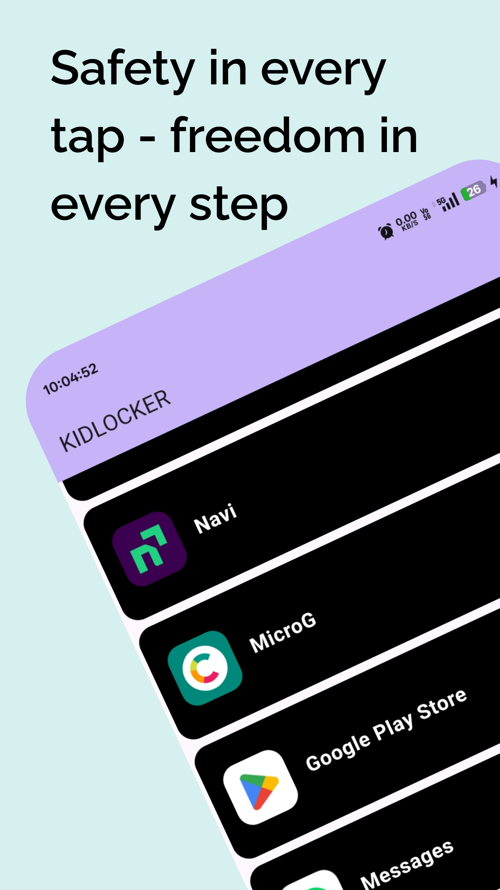
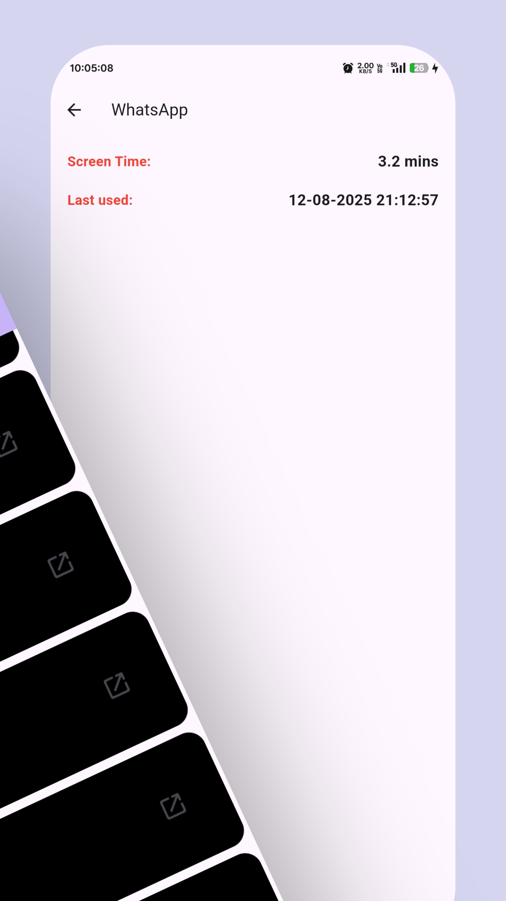
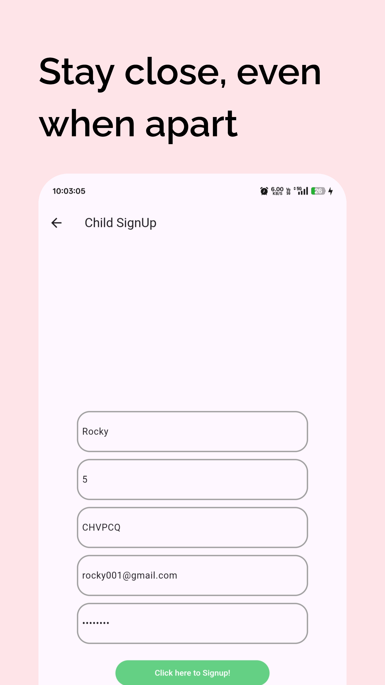
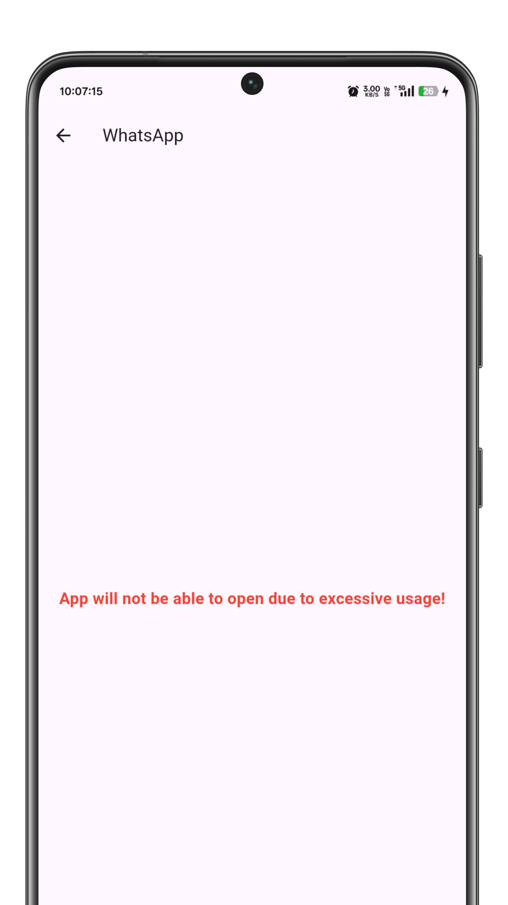

#  PATLOCKER – Child App

>  A safe, intuitive companion app for kids, seamlessly controlled through the parent’s PATLOCKER interface.

---

##  About

`childApp` is part of the **PATLOCKER** parental control ecosystem. Built with **Flutter**, it offers a lightweight, user-friendly experience tailored for children. The app syncs with a parent controller app to deliver real-time location updates, activity tracking, and secure navigation—all while ensuring a fun and safe digital environment.

---

##  Key Features

-  **Real-Time Location Sharing** — Seamless connection with the parent app to keep guardians informed.
-  **App Usage Tracking** — Monitor which apps are used and for how long.
- ⏰ **Screen Time Management** — Enforced time restrictions for healthy device usage.
-  **Alert Notifications** — Instant alerts for unauthorized access or restricted activities.
-  **Offline Functionality** — Basic app functions operate even without internet.
-  **Simple, Kid-Friendly UI** — Bright, engaging, and easy for kids to navigate.

---

##  Preview

| Home Screen | Activity View | Signup | Restricted |
|-------------|-----------|----------------|----------------|
|  |  |  |  |

---

##  Tech Stack

- **Framework:** Flutter (cross-platform mobile)  
- **Language:** Dart  
- **State Management:** Screen Time, Block App
- **Backend Sync:** Firebase (Authentication & Firestore for real-time data)

---

##  Prerequisites

- [Flutter SDK](https://flutter.dev/docs/get-started/install)  
- [Dart](https://dart.dev/get-dart)  
- An IDE like Android Studio or VS Code

---

##  How to Run Locally

```bash
# 1. Clone the main PATLOCKER repo
git clone https://github.com/MADHANKUMAR-C/PATLOCKER.git

# 2. Navigate into the childApp folder
cd PATLOCKER/childApp

# 3. Install dependencies
flutter pub get

# 4. Launch the app on a device or emulator
flutter run
```

---

##  Organization & Directory Structure

```bash
childApp/
├── android/ & ios/  — Platform-specific files
├── lib/             — Main app code (Dart)
├── screenshots/  — App UI previews
├── pubspec.yaml     — Project metadata & dependencies
└── README.md        — This document
```

---

##  Get in Touch

- **Developer:** Madhan Kumar  
- **Email:** [madhankumar8825487841@gmail.com](mailto:madhankumar8825487841@gmail.com)  
- **LinkedIn:** [Madhan Kumar C](https://www.linkedin.com/in/madhankumar-c-601132273)
  
---

##  Star/Fork badge

[](https://github.com/MADHANKUMAR-C/PATLOCKER/stargazers)
