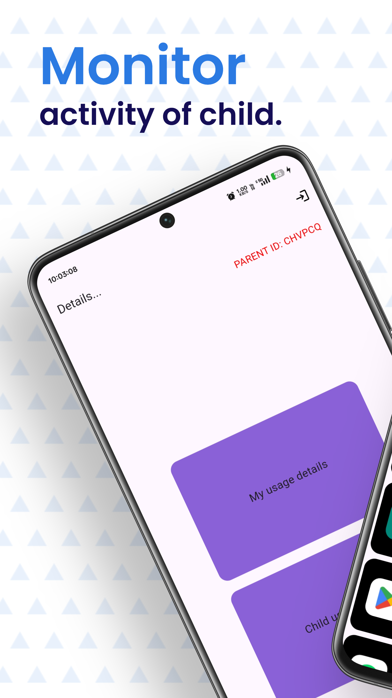
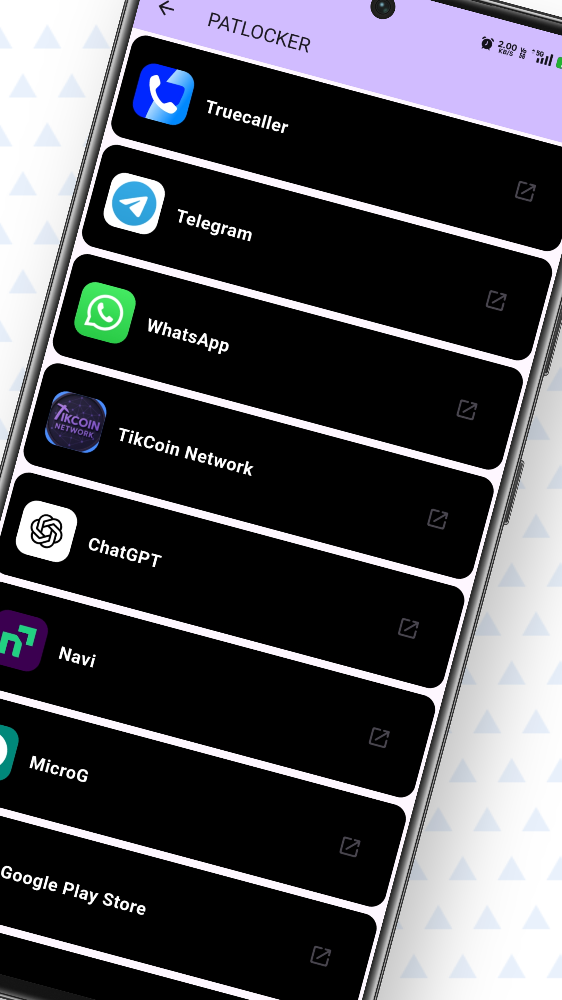
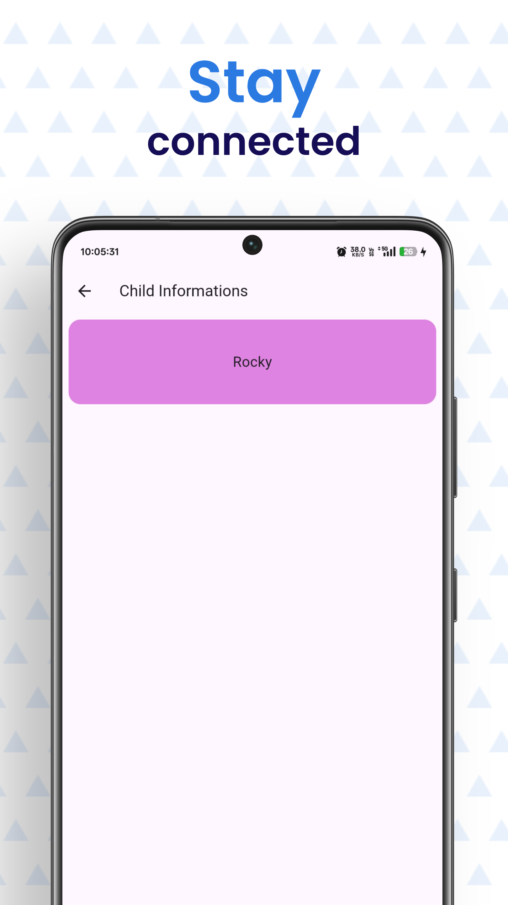
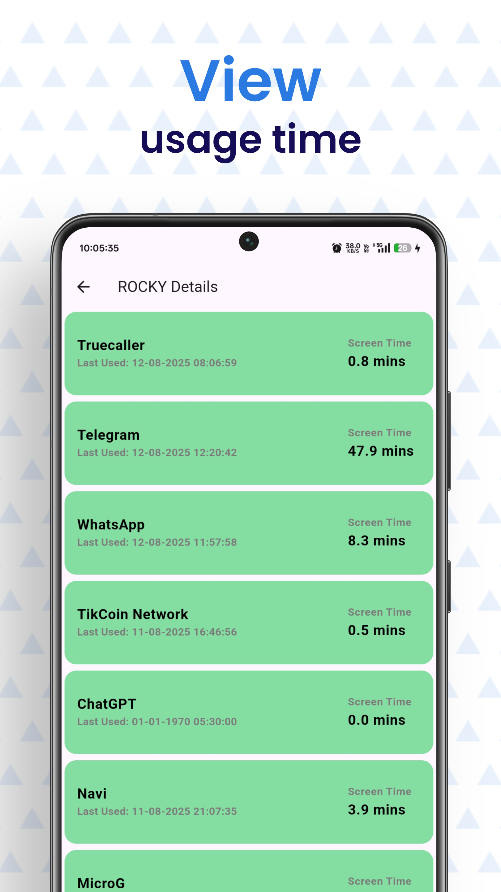
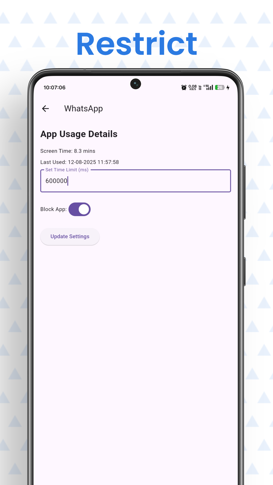

#  PATLOCKER – Parent App

>   Take control, ensure safety, and stay connected — your all-in-one parental control dashboard.

---

##  About

`parentApp`  is the central command hub of the PATLOCKER parental control ecosystem. Built with Flutter, it enables parents or guardians to monitor, manage, and control their child’s digital activity in real-time. The app connects seamlessly with the Child App, offering tools for location tracking, screen time management, and app blocking.

---

##  Key Features

-  **Live Location Tracking** — See where your child is at any time.
-  **App Usage Insights** — View app usage statistics for better monitoring.
- ⏰ **Screen Time Management** — Set and enforce device usage limits remotely.
-  **App Blocking** — Instantly block specific apps on the child’s device.
-  **Alert System** — Receive immediate notifications for restricted actions or location changes.
-  **Multi-Child Management** — Connect and manage multiple child devices from one dashboard.

---

##  Preview

|  |  |
|-------------------------------|-------------------------------|
|  |  |


---

##  Tech Stack

- **Framework:** Flutter (cross-platform mobile)  
- **Language:** Dart  
- **State Management:** Screen Time, Block App
- **Backend Sync:** Firebase (Authentication & Firestore for real-time data)

---

##  Prerequisites

- [Flutter SDK](https://flutter.dev/docs/get-started/install)  
- [Dart](https://dart.dev/get-dart)  
- An IDE like Android Studio or VS Code

---

##  How to Run Locally

```bash
# 1. Clone the main PATLOCKER repo
git clone https://github.com/MADHANKUMAR-C/PATLOCKER.git

# 2. Navigate into the childApp folder
cd PATLOCKER/parentApp

# 3. Install dependencies
flutter pub get

# 4. Launch the app on a device or emulator
flutter run
```

---

##  Organization & Directory Structure

```bash
parentApp/
├── android/ & ios/  — Platform-specific files
├── lib/             — Main app code (Dart)
├── screenshots/     — App UI previews
├── pubspec.yaml     — Project metadata & dependencies
└── README.md        — This document
```

---

##  Get in Touch

- **Developer:** Madhan Kumar  
- **Email:** [madhankumar8825487841@gmail.com](mailto:madhankumar8825487841@gmail.com)  
- **LinkedIn:** [Madhan Kumar C](https://www.linkedin.com/in/madhankumar-c-601132273)
  
---

##  Star/Fork badge

[](https://github.com/MADHANKUMAR-C/PATLOCKER/stargazers)
